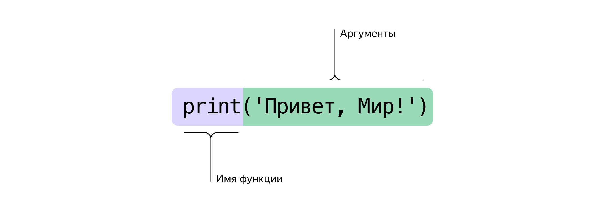
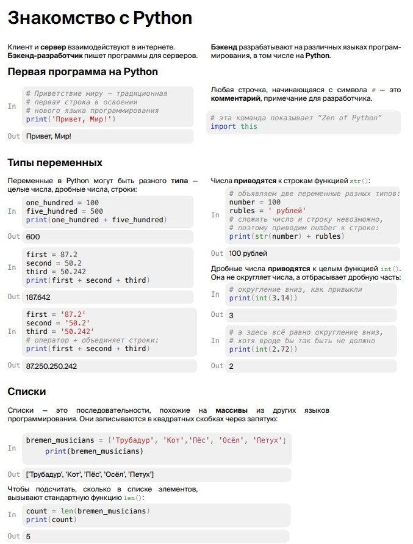
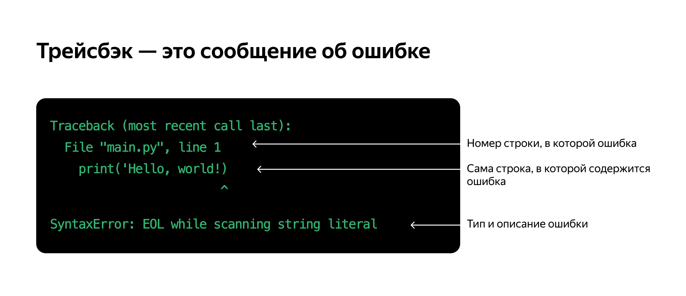

# Python-training

## Кто такой бэкенд-разработчик
Учим писать бэкенд на Python
На нашем курсе вы научитесь писать на Python. Это популярный язык программирования, он хорош для начинающих разработчиков и применяется во многих сферах — от машинного обучения до создания игр и проведения научных исследований. Но наш курс посвящён одной конкретной сфере применения — мы учим писать бэкенд.

Возможно, вы храните свои файлы в Dropbox, смотрите фильмы на Netflix, слушаете музыку в Spotify или смотрите картинки в Pinterest. Бэкенд этих веб-сервисов частично или полностью написан на Python.
Бэкенд и фронтенд
Зайдите на любой сайт, например, в интернет-магазин: вы увидите текст, графику, заголовки, иконки, кнопки, ссылки. Вся видимая часть сайта — это фронтенд, часть проекта,  предназначенная для взаимодействия с пользователем; эту часть готовят фронтенд-разработчики. 
Посетитель интернет-магазина взаимодействует с фронтендом сайта, фронтенд — с сервером. А на сервере происходит много невидимых пользователю процессов: там информация записывается в базу данных и считывается из неё, данные передаются продавцу и в службу доставки, происходят вычисления — эта скрытая от пользователя программная часть и есть бэкенд сайта.
Если коротко, то фронтенд — это лицо сайта, бэкенд — его мозг.

## Почему мы учим программировать на Python
Бэкенд можно писать на разных языках программирования: на Java, PHP, Ruby, C#, Go, но мы выбрали Python. Этот язык хорошо подходит для начинающих программистов — и в то же время это мощное и современное средство разработки. 
Главные преимущества Python:
Лаконичность: на питоне нужно писать гораздо меньше кода для выполнения команд. Сравните, как выглядит один и тот же код, написанный на Java и на Python.
  Этот код печатает на экране приветствие.
  Python:
  print('Привет, Практикум!')
   
  Java:
  public class HelloPracticum {
      public static void main(String[] args) {
          System.out.println("Привет, Практикум!");
      }
  }
   
Широта применения: набив руку на веб-сервисах, наши выпускники могут развивать полученные навыки в других сферах — в машинном обучении, аналитике данных, мобильной разработке, играх, научных исследованиях.
Востребованность на рынке: на Python пишут и в небольших студиях, и в огромных корпорациях. И всем нужны разработчики. Ну, почти всем.

## Найдётся всё
Python — простой язык программирования с лаконичным и понятным синтаксисом.
Обычно программы состоят из множества строк, в которых записаны команды на языке Python. Команды выполняются последовательно, строка за строкой, и в результате программа решает свою задачу.
Перед вами простая программа, состоящая из одной команды на Python: import this.
Выполните программу: в нижней части блока с кодом нажмите кнопку «Запустить код».
Это не обыкновенная команда, а «пасхальное яйцо», или «пасхалка»: она выводит на экран «Дзен Питона».

## Питон в позе лотоса
Дзен Питона — это рекомендации, как сделать ваш код красивым и понятным. 
Когда вы изучите Python настолько, что сможете решить одну и ту же задачу разными способами — возвращайтесь к этим правилам, и каждый раз вы будете видеть в них новый смысл.
Красивое лучше, чем уродливое.
1. Явное лучше, чем неявное.
2. Простое лучше, чем сложное.
3. Сложное лучше, чем запутанное.
4. Плоское лучше, чем вложенное.
5. Разреженное лучше, чем плотное.
6. Читаемость имеет значение.
7. Особые случаи не настолько особые, чтобы нарушать правила.
8. При этом практичность важнее безупречности.
9. Ошибка никогда не должна замалчиваться.
10. Если только вы сами этого не захотите.
11. Встретив двусмысленность, отбрось искушение угадать.
12. Должен существовать один и, желательно, только один очевидный способ сделать что-то.
13. Хотя он поначалу может быть и не очевиден, если вы не голландец.
14. Сейчас лучше, чем никогда.
15. Хотя никогда зачастую лучше, чем прямо сейчас.
16. Если реализацию сложно объяснить — идея плоха.
17. Если реализацию легко объяснить — идея, возможно, хороша.
18. Пространства имён — отличная штука! Будем делать их больше!

Запустите код, посмотрите на результат. Поэкспериментируйте: измените что-нибудь в коде и запустите его вновь. Если в результате экспериментов код окончательно сломается — нажмите кнопку «Начать заново», исходный код будет восстановлен.
Код
PYTHON
name = 'Вася'
num = "23"
print('Здесь был', name)
print('Возраст', num)

## Результат
Здесь был Вася
Возраст 23

Первая команда: «положить в переменную name слово "Вася"». Программист мог записать в эту переменную любое имя или слово.
Вторая команда: «напечатать на экран сообщение "Здесь был" и то слово, которое хранится в переменной name».
Программирование — это процесс написания таких вот команд. Разработчик пишет их, потом нажимает кнопку, и компьютер их выполняет. Вот и вся магия.

DNS - Это система доменных имен. Она соотносит привычный адрес сайта с Ip адресом сервера и сообщает  адрес вашему браузеру.
Клиентская чать сайта, та которую видит пользователь, называется Frontend (Этим полностью управляют HTML, CSS, JavaScript)
Серверные языки програмирования и базы данных - это Backend
Работа с Frontend и Backend частами сайта называется Fullstack разработкой
Backend содержит в себе код, который обрабатывает запросы от клиентов, а так же общается базой данных и формирует ответ на запрос.

Программа вывела на экран сообщение «Привет, Мир!»: Python прочитал код, увидел в нём функцию print() и выполнил её. 
Функция — это подпрограмма, выполняющая определённые действия. Функция print() — это встроенная в Python подпрограмма для вывода данных на экран (или для «печати на экране», на жаргоне программистов).
'Привет, Мир!' — это текст, который функция print() напечатает. Функция print() выводит на экран любые данные, указанные в скобках после названия функции. 
Программисты называют такие данные «аргументы»; их (аргументы, а не программистов!) указывают в скобках после имени функции. 
В аргументе функции print() в коде программы, которую вы только что запускали, замените слово Мир на своё имя — и запустите код ещё раз.

# Говорят, что аргумент передаётся в функцию, а функция их принимает. Python выполняет код, читая его строка за строкой; увидев в коде имя функции с круглыми скобками, Python вызывает эту функцию. При необходимости функцию можно вызывать много раз.

Нажмите кнопку «Запустить код». 
Python прочтёт код сверху вниз и выполнит все инструкции, которые увидит.

# Код для людей: комментарии
Строки, начинающиеся с символа # — это комментарии, примечания, которые автор программы пишет для других разработчиков. 
Python игнорирует любые символы на строчке после #. Обратите внимание, что комментарии автоматически выделяются цветом, это упрощает чтение.
Если символом комментария скрыть часть кода — Python перестанет видеть этот код и не станет его выполнять.

# полезная информация

# Переменные и типы
Отлично, вы научились выводить строки на экран. Но просто напечатать строку — этого мало.
Представьте: вы читаете книгу, но не можете запомнить, сколько страниц прочли. Умеете читать, но вот сохранить в памяти номер страницы не удаётся. Вылетает из головы, где вы остановились, поэтому приходится отсчитывать страницы от начала книги. 10, 24, 140, 250 страниц — и так каждый раз.

# Так же беспомощны программы, которые не могут сохранять данные. Именно поэтому настоящее программирование начинается с переменных, запоминающих результаты промежуточных действий.
Переменная работает как подписанная коробка или помеченная ячейка, куда можно что-то положить и не потерять.
Когда в коде впервые пишут имя переменной, это называется объявление переменной. Имя придумывает сам программист. 
В Python переменную объявляют, присваивая ей какое-нибудь значение. Для объявления переменной достаточно просто указать имя, поставить знак «равно» = (этот знак в Питоне называется оператор присваивания) и написать значение, которое будет храниться в переменной.
Смысл оператора присваивания = отличается от того, к которому вы привыкли. В программировании выражение x = 1 означает: «теперь в переменной x хранится значение 1». 
После того как переменной присвоено какое-то значение, его можно заменить: для этого нужно присвоить этой переменной другое значение: x = 38. Теперь в переменной x хранится не единица, а число 38.
Вернёмся к чтению. Отложив программирование и ночной сон, вы прочли 210 страниц. Теперь можно написать так:
pages = 210 
Здесь создана переменная с именем pages, в этой переменной сохранено значение 210. 
В переменных можно сохранить не только числа: в них можно «положить» и строку. Например, строка 'Привет, Мир!' — это другой пример данных, которые могут храниться в переменной.
# Объявили переменную с именем message и присвоили ей значение:
# строку 'Привет, Мир!'
message = 'Привет, Мир!' 
А теперь следующий шаг: когда переменная объявлена и ей присвоено значение — имя этой переменной можно указывать в коде, и вместо имени будет подставляться её значение. 
Поэкспериментируйте:
1. Запустите код, в нём в функцию print() передана переменная message.
2. Замените фразу 'Привет, Мир!' на какую-нибудь другую и запустите код ещё раз.
message = 'Привет, я знакомлюсь с Python первый раз' Создана переменная "message"
# В функцию передан не текст, а переменная, в которой хранится текст:
print(message)

## Типы данных: числа и строки
Значения переменных различаются по своей сути: например, значения могут быть числами или строками. Это разные типы данных. В Python есть и другие типы, но пока хватит и этих двух.
Строка записывается как символ или набор символов внутри 'одинарных' либо "двойных" кавычек.
genre = 'Роман'  # Строка в одинарных кавычках
author = "Джордж Оруэлл"  # Строка в двойных кавычках
title = '1984'  # Число в кавычках тоже становится строкой
space = ' ' # Даже пробел — это тоже строка

## Для обрамления строк можно пользоваться одинарными или двойными кавычками, но главное — открывающая и закрывающая кавычки должны быть одинаковыми.

## Числовые значения записываются без кавычек:
twenty_five = 25
about_pi = 3
# Обратите внимание: в редакторе кода числа и строки выделяются разными цветами, чтобы читать исходный код было легче.

## Со значениями разных типов Python работает по-разному. 
С переменными, которые содержат числа, можно проводить любые арифметические операции: например, складывать их при помощи оператора +:

twenty_five = 25
about_pi = 3
# Переменные одного типа можно складывать, 
# а получившееся значение присваивать другой переменной
total = twenty_five + about_pi

# Напечатаем эту переменную:
print(total)

# Объединение нескольких строк в одну называют «конкатенацией» (от лат. concatenatio, «присоединение, сцепление»).
# А вот сложить число и строку так просто не удастся: складывать можно значения одинакового типа, иначе Python выдаст ошибку.

# Python позволяет перевести значение переменной из одного типа в другой (конвертировать тип данных; иначе говорят «привести к типу»).
Преобразованием данных из одного типа в другой занимаются специальные функции. Так, для превращения числа в строку вызывают функцию str():
А преобразовать строку в целое число можно функцией int().

# Python изо всех сил постарается помочь вам найти ошибку, предоставляя всю возможную информацию о проблеме: «Я сломался, ошибка на строке 8, там забыли закрыть скобку!»
Разговаривает Python по-английски, но понять его несложно, даже если у вас нет глубоких познаний в языке. Читайте всё, что он пишет: это поможет самостоятельно разобраться с ошибкой. Сообщения об ошибках называются traceback (по-русски говорят «трейсбэк»).

Посмотрите внимательно на код и запустите его.

print(3 + )

В результате вы получите сообщение SyntaxError, «ошибка синтаксиса»: при сложении забыли написать одно слагаемое.
Сообщение invalid syntax переводится как «недопустимый синтаксис». Поправьте ошибку — прибавьте к тройке любое число и запустите код.

Другую разновидность ошибки SyntaxError можно получить, если забыть скобку или кавычку. 
Выполните этот кривой код и прочтите ответ Питона.

print(3 + 5

В тексте SyntaxError: unexpected EOF while parsing сокращение EOF означает end of file, а само сообщение переводится как «неожиданный конец файла во время разбора кода программы»: Python увидел начало вызова функции, но внезапно код программы закончился. Поправьте код и запустите его вновь.

Дело в том, что Python разрешает ставить открывающую и закрывающую скобки на разных строчках. Поэтому он терпеливо дожидается, пока код совершенно утратит смысл, и только тогда выдаёт ошибку.
Если код состоит из нескольких строк, ошибка с незакрытой скобкой показывается не на той строчке, где забыли закрыть скобку, а на следующей.
Этот код показал и ещё одну особенность поведения Python: при любой ошибке выполнение кода полностью останавливается; код, написанный после строки с ошибкой, не будет выполнен, будь он даже самый распрекрасный и правильный. 
Поправьте ошибку, запустите код  — и двигайтесь дальше, к новым ошибкам :)

Опять ошибка: SyntaxError: EOL while scanning string literal; сокращение EOL означает end of line, а полный текст сообщения переводится как «конец строки во время обработки текста». Python увидел открывающую кавычку, но строчка закончилась, а закрывающей кавычки не было. На этом Python сломался.